# 🌳 TbSense Backend

**TbSense Backend** is a comprehensive IoT-enabled plantation management system designed to monitor, analyze, and optimize tree plantation operations. The system provides real-time environmental monitoring, harvest tracking, yield prediction, and advanced analytics through a RESTful API built with .NET 9.0.

[](https://dotnet.microsoft.com/)
[](https://docs.microsoft.com/ef/core/)
[](https://www.postgresql.org/)
[](https://fast-endpoints.com/)

---

## 📋 Table of Contents

- [Features](#-features)
- [Architecture](#-architecture)
- [Technology Stack](#-technology-stack)
- [Prerequisites](#-prerequisites)
- [Getting Started](#-getting-started)
- [Project Structure](#-project-structure)
- [API Documentation](#-api-documentation)
- [Database Schema](#-database-schema)
- [Configuration](#-configuration)
- [Development](#-development)
- [Testing](#-testing)
- [Deployment](#-deployment)
- [Contributing](#-contributing)
- [License](#-license)

---

## ✨ Features

### 🌱 Plantation Management

- **Multi-Plantation Support**: Manage multiple plantations with detailed profiles
- **Geospatial Tracking**: GPS coordinates for plantations and individual trees
- **Land Area Management**: Track land usage and density metrics
- **Growth Monitoring**: Historical tracking of plantation expansion

### 🌳 Tree Monitoring

- **IoT Sensor Integration**: Real-time environmental data collection
- **Individual Tree Tracking**: Monitor 5,387+ trees with unique identifiers
- **Health Status**: Active/inactive status tracking
- **Environmental Metrics**:
  - Air Temperature
  - Soil Temperature
  - Soil Moisture

### 📊 Advanced Analytics (51 Chart Endpoints)

- **9 Pie Charts**: Distribution analysis (tree activity, harvest distribution, environmental zones)
- **14 Bar Charts**: Comparative analysis (plantation ranking, top performers, weekly trends)
- **13 Histograms**: Statistical distributions (yield, temperature, moisture, age)
- **15 Area Charts**: Cumulative trends (growth tracking, stress monitoring, adoption rates)

### 🌾 Harvest Management

- **Harvest Recording**: Track 470+ harvest events with detailed metrics
- **Quality Grading**: Grade A/B/C classification
- **Yield Analysis**: Total and average yield calculations
- **Temporal Analysis**: Monthly, weekly, and daily harvest patterns

### 🤖 Machine Learning Integration

- **Yield Prediction**: ML models for harvest forecasting
- **Model Training**: Integrated training service with external Python trainer
- **Model Versioning**: Track and manage multiple prediction models
- **Performance Metrics**: Model accuracy and evaluation tracking

### 📈 Dashboard System

- **Global Dashboard**: Portfolio-wide analytics and KPIs
- **Plantation Dashboard**: Individual plantation deep-dive analysis
- **Tree Dashboard**: Single tree health and history monitoring
- **Data Explorer**: Advanced filtering and data export capabilities

### 🔐 Data Management

- **Pagination Support**: Efficient data retrieval with filtering and sorting
- **Advanced Filtering**: Multi-field filtering with operators
- **CSV/Excel Export**: Data export for external analysis
- **Audit Trail**: Complete history of all operations

---

## 🏗️ Architecture

TbSense Backend follows **Clean Architecture** principles with clear separation of concerns:

### System Architecture Overview

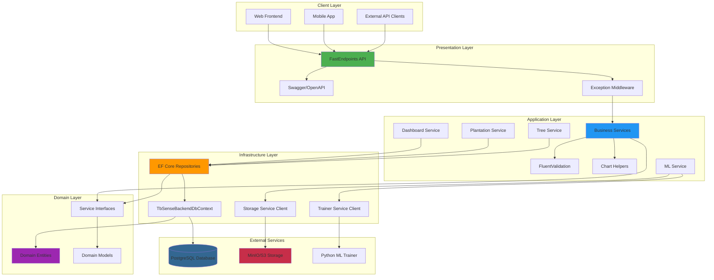

### Clean Architecture Layers

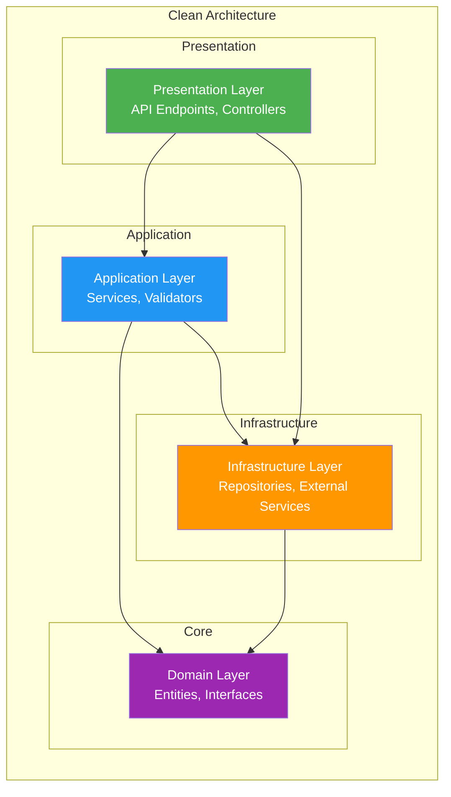

### Project Dependencies

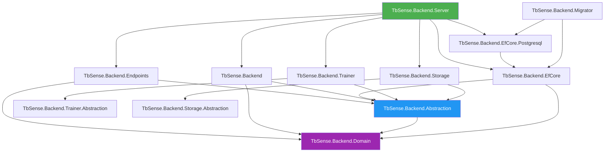

### Request Flow

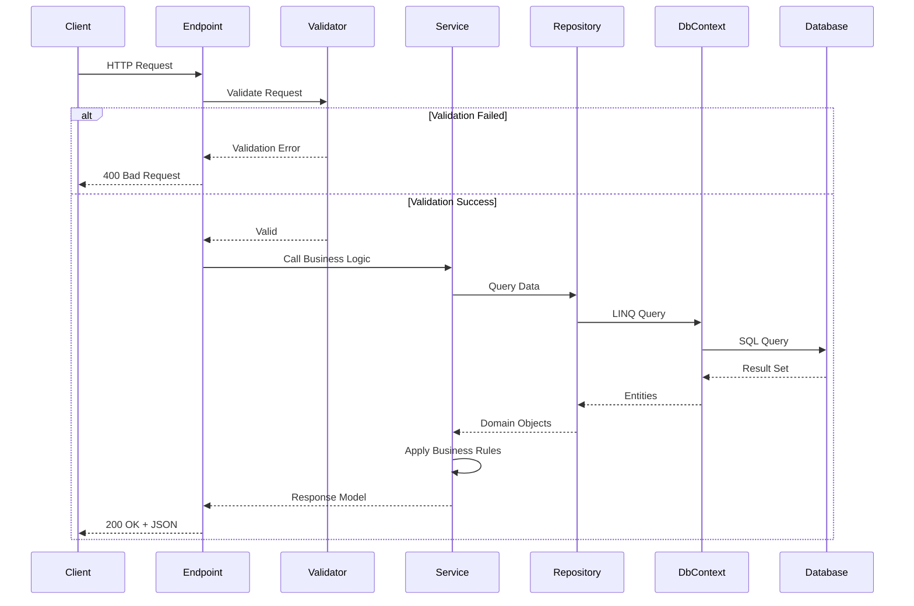

### Dashboard Analytics Flow

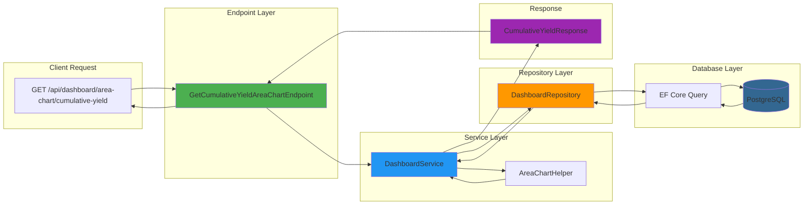

### ML Training Workflow

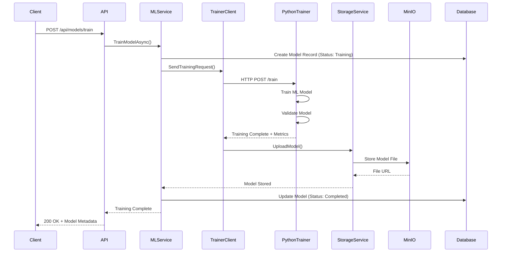

### Data Flow - Tree Metrics Collection

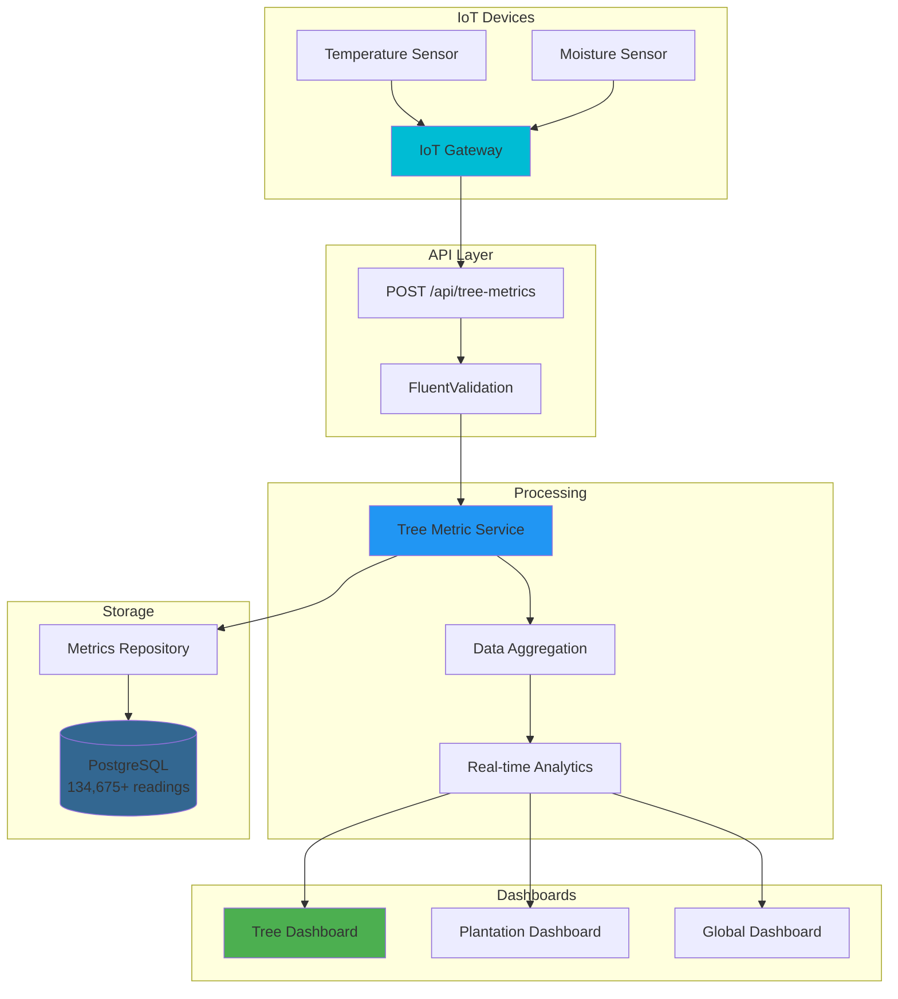

### Chart Generation Architecture

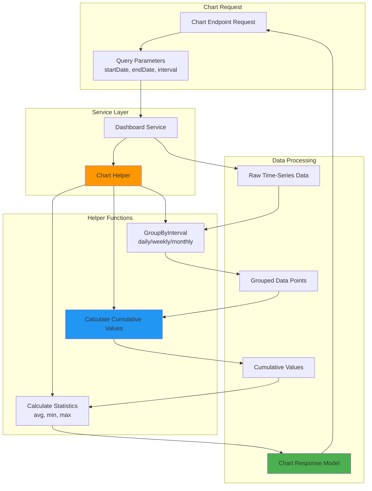

### Design Patterns Used

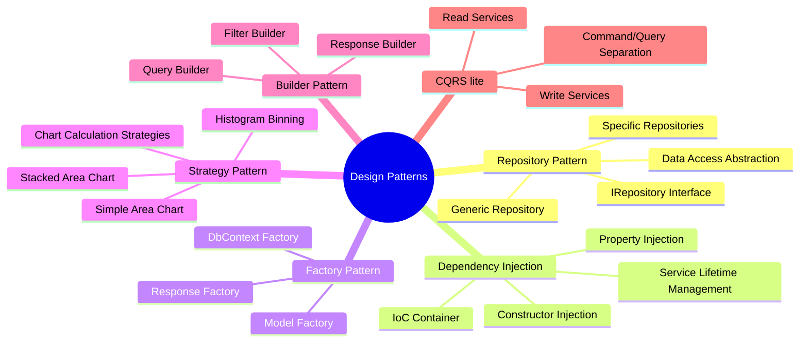

### Database Entity Relationships

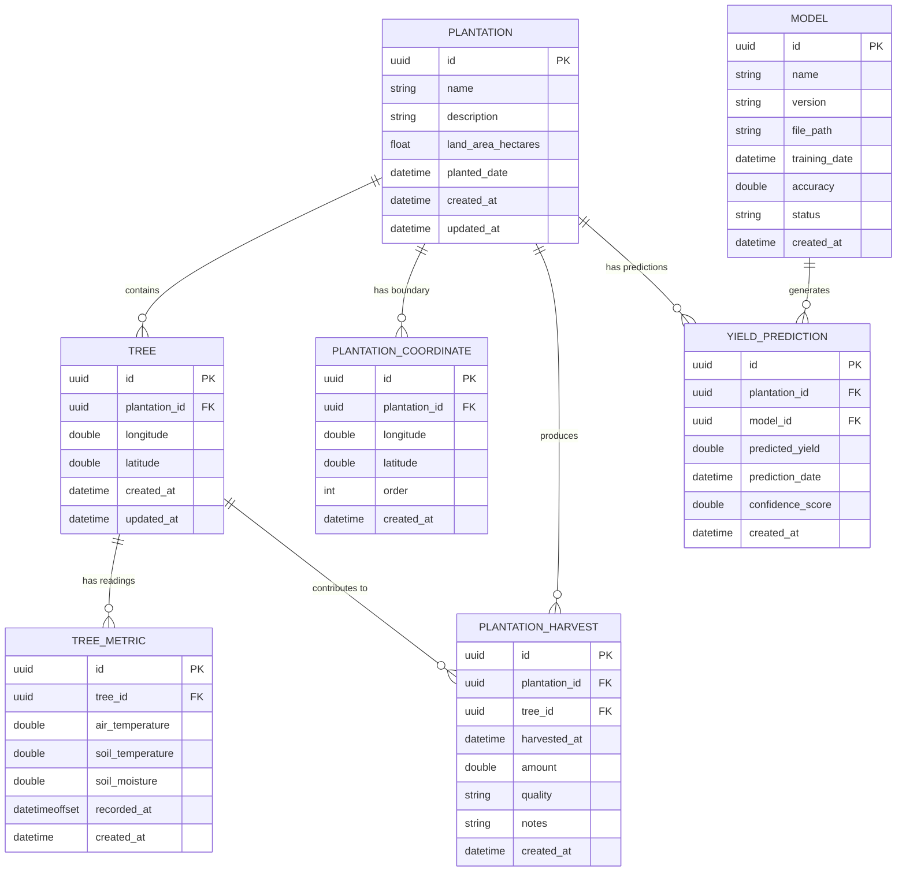

### Technology Stack Integration

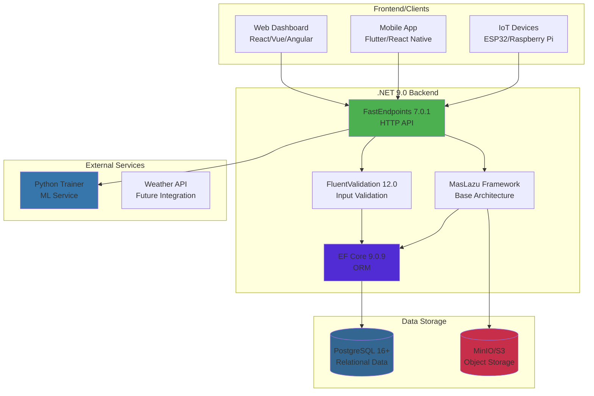

### Deployment Architecture

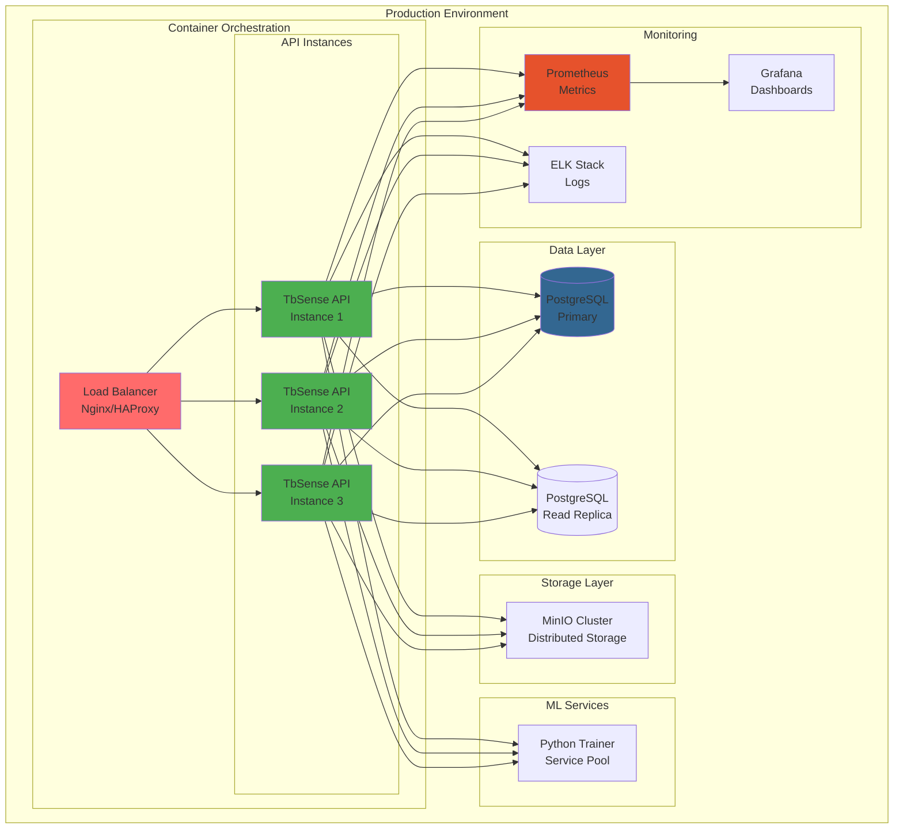

### Design Patterns Summary

- **Repository Pattern**: Data access abstraction
- **Dependency Injection**: IoC container for loose coupling
- **CQRS-lite**: Read/Write separation in services
- **Factory Pattern**: DbContext factory for migrations
- **Strategy Pattern**: Multiple chart calculation strategies
- **Builder Pattern**: Complex query and response construction
- **Singleton Pattern**: DbContext configuration
- **Chain of Responsibility**: Middleware pipeline

---

## 🛠️ Technology Stack

### Backend Framework

- **.NET 9.0**: Latest .NET platform
- **C# 13**: Modern C# with nullable reference types
- **FastEndpoints 7.0.1**: High-performance endpoint routing
- **MasLazu.AspNet.Framework**: Custom framework utilities

### Database & ORM

- **PostgreSQL 16+**: Primary relational database
- **Entity Framework Core 9.0.9**: ORM for data access
- **Npgsql**: PostgreSQL provider for .NET

### Storage & ML

- **FluentStorage 6.0.0**: Abstraction for cloud storage
- **AWS S3 / MinIO**: Object storage for ML models
- **External Python Service**: ML model training

### Validation & Documentation

- **FluentValidation 12.0.0**: Request validation
- **FastEndpoints.Swagger 7.0.1**: OpenAPI/Swagger documentation
- **Microsoft.AspNetCore.OpenApi 9.0.9**: OpenAPI support

### Testing

- **xUnit 2.9.3**: Testing framework
- **Coverlet**: Code coverage analysis
- **Unit Tests**: Business logic validation
- **Integration Tests**: API endpoint testing
- **E2E Tests**: End-to-end workflow testing

---

## 📋 Prerequisites

### Required Software

- **.NET 9.0 SDK** or later ([Download](https://dotnet.microsoft.com/download))
- **PostgreSQL 16+** ([Download](https://www.postgresql.org/download/))
- **Docker** (optional, for containerized services) ([Download](https://www.docker.com/))

### Optional Services

- **MinIO** or **AWS S3** (for model storage)
- **Python 3.10+** (for ML trainer service)

### Development Tools

- **Visual Studio 2022** / **VS Code** / **Rider**
- **Git** for version control
- **Postman** / **Thunder Client** (API testing)

---

## 🚀 Getting Started

### 1. Clone the Repository

```bash
git clone https://github.com/MasLazu/tbsense-backend.git
cd tbsense-backend
```

### 2. Configure Database

Create a PostgreSQL database:

```sql
CREATE DATABASE tbsense_db;
```

Update connection string in `appsettings.Development.json`:

```json
{
  "ConnectionStrings": {
    "DefaultConnection": "Host=localhost;Database=tbsense_db;Username=postgres;Password=yourpassword"
  }
}
```

### 3. Run Migrations

```bash
# Navigate to migrator project
cd src/TbSense.Backend.Migrator

# Run migrations
dotnet run
```

Or use Entity Framework CLI:

```bash
# From solution root
dotnet ef database update --project src/TbSense.Backend.EfCore.Postgresql --startup-project src/TbSense.Backend.Migrator
```

### 4. Configure External Services (Optional)

**MinIO for Model Storage:**

```bash
# Run MinIO with Docker
docker run -p 9000:9000 -p 9001:9001 \
  -e MINIO_ROOT_USER=minioadmin \
  -e MINIO_ROOT_PASSWORD=minioadmin \
  quay.io/minio/minio server /data --console-address ":9001"
```

Update `appsettings.Development.json`:

```json
{
  "MinIO": {
    "Endpoint": "localhost:9000",
    "AccessKey": "minioadmin",
    "SecretKey": "minioadmin",
    "BucketName": "models",
    "UseSSL": false
  }
}
```

**Python Trainer Service:**

```json
{
  "TrainerService": {
    "BaseUrl": "http://localhost:5001",
    "TimeoutMinutes": 30
  }
}
```

### 5. Run the Application

```bash
# Navigate to server project
cd src/TbSense.Backend.Server

# Run in development mode
dotnet run

# Or with hot reload
dotnet watch run
```

The API will be available at:

- **HTTP**: `http://localhost:5000`
- **HTTPS**: `https://localhost:5001`
- **Swagger UI**: `http://localhost:5000/swagger`

### 6. Seed Sample Data (Optional)

```bash
# Run seeding script (if available)
dotnet run --project src/TbSense.Backend.Migrator -- --seed

# Or use SQL scripts in /sql directory
psql -U postgres -d tbsense_db -f sql/seed_data.sql
```

---

## 📁 Project Structure

```
tbsense-backend/
├── src/
│   ├── TbSense.Backend/                    # Core business logic
│   │   ├── Services/                       # Business services
│   │   ├── Utils/                          # Utility classes
│   │   ├── Validators/                     # FluentValidation validators
│   │   └── Extensions/                     # Service extensions
│   │
│   ├── TbSense.Backend.Abstraction/        # Interfaces and contracts
│   │   ├── Interfaces/                     # Service interfaces
│   │   └── Models/                         # DTOs and response models
│   │       ├── Dashboard/                  # Dashboard models
│   │       ├── PieCharts/                  # Pie chart models
│   │       ├── BarCharts/                  # Bar chart models
│   │       ├── Histograms/                 # Histogram models
│   │       └── AreaCharts/                 # Area chart models
│   │
│   ├── TbSense.Backend.Domain/             # Domain entities
│   │   └── Entities/                       # EF Core entities
│   │       ├── Plantation.cs               # Plantation entity
│   │       ├── Tree.cs                     # Tree entity
│   │       ├── TreeMetric.cs               # Sensor readings
│   │       ├── PlantationHarvest.cs        # Harvest records
│   │       ├── PlantationCoordinate.cs     # GPS coordinates
│   │       ├── PlantationYieldPrediction.cs # ML predictions
│   │       └── Model.cs                    # ML model metadata
│   │
│   ├── TbSense.Backend.EfCore/             # Data access layer
│   │   ├── Data/                           # DbContext
│   │   ├── Configurations/                 # Entity configurations
│   │   └── Extensions/                     # EF Core extensions
│   │
│   ├── TbSense.Backend.EfCore.Postgresql/  # PostgreSQL provider
│   │   └── Extensions/                     # PostgreSQL setup
│   │
│   ├── TbSense.Backend.Endpoints/          # API endpoints
│   │   ├── Endpoints/
│   │   │   ├── Dashboard/                  # Global dashboard (51 charts)
│   │   │   ├── PlantationDashboard/        # Plantation analytics
│   │   │   ├── TreeDashboard/              # Tree monitoring
│   │   │   ├── Plantations/                # CRUD operations
│   │   │   ├── Trees/                      # Tree management
│   │   │   ├── PlantationHarvests/         # Harvest records
│   │   │   ├── TreeMetrics/                # Sensor data
│   │   │   ├── PlantationCoordinates/      # GPS data
│   │   │   ├── PlantationYieldPredictions/ # ML predictions
│   │   │   └── Models/                     # ML model management
│   │   ├── EndpointGroups/                 # Endpoint grouping
│   │   └── Models/                         # Request/Response DTOs
│   │
│   ├── TbSense.Backend.Migrator/           # Database migrations
│   │   ├── Migrations/                     # EF Core migrations
│   │   └── Program.cs                      # Migration runner
│   │
│   ├── TbSense.Backend.Server/             # Web API host
│   │   ├── Program.cs                      # Application entry point
│   │   ├── appsettings.json                # Configuration
│   │   └── Extensions/                     # Server extensions
│   │
│   ├── TbSense.Backend.Trainer/            # ML training integration
│   │   └── Services/                       # Trainer service client
│   │
│   ├── TbSense.Backend.Trainer.Abstraction/ # Trainer contracts
│   │   ├── Interfaces/                     # Trainer interfaces
│   │   └── Models/                         # Training DTOs
│   │
│   ├── TbSense.Backend.Storage/            # File storage
│   │   └── Services/                       # Storage service
│   │
│   └── TbSense.Backend.Storage.Abstraction/ # Storage contracts
│       └── Interfaces/                     # Storage interfaces
│
├── test/
│   ├── TbSense.Backend.UnitTests/          # Unit tests
│   ├── TbSense.Backend.IntegrationTests/   # Integration tests
│   └── TbSense.Backend.E2ETests/           # End-to-end tests
│
├── Directory.Packages.props                # Centralized package management
├── TbSense.Backend.sln                     # Solution file
└── README.md                               # This file
```

---

## 📚 API Documentation

### Swagger UI

Access interactive API documentation at:

```
http://localhost:5000/swagger
```

### API Endpoints Overview

#### 🌍 **Global Dashboard** (`/api/dashboard`)

**Summary Endpoints:**

- `GET /plantations-summary` - Portfolio overview
- `GET /trees-summary` - Tree statistics
- `GET /land-area-summary` - Land metrics
- `GET /harvest-summary` - Harvest KPIs
- `GET /environmental-averages` - Climate data

**Pie Charts (9 endpoints):**

- `GET /pie-chart/plantations-by-trees`
- `GET /pie-chart/plantations-by-land-area`
- `GET /pie-chart/harvest-by-plantation`
- `GET /pie-chart/tree-activity-status`

**Bar Charts (14 endpoints):**

- `GET /bar-chart/top-plantations-by-yield?limit=10`
- `GET /bar-chart/top-plantations-by-avg-harvest?limit=10`
- `GET /bar-chart/tree-count-by-plantation?limit=10`
- `GET /bar-chart/tree-activity-by-plantation`
- `GET /bar-chart/harvest-frequency-by-plantation`

**Histograms (13 endpoints):**

- `GET /histogram/yield-distribution?binCount=15`
- `GET /histogram/plantation-size-distribution?binCount=10`
- `GET /histogram/tree-density-distribution?binCount=12`
- `GET /histogram/harvest-frequency-distribution`
- `GET /histogram/avg-harvest-size-distribution`

**Area Charts (15 endpoints):**

- `GET /area-chart/cumulative-yield?interval=daily`
- `GET /area-chart/cumulative-harvest-count?interval=weekly`
- `GET /area-chart/plantation-growth?interval=monthly`
- `GET /area-chart/tree-population-growth?interval=weekly`
- `GET /area-chart/cumulative-active-trees?interval=daily`
- `GET /area-chart/stacked-yield-by-plantation?limit=10&interval=monthly`

**Timeseries:**

- `GET /timeseries/environmental?interval=hourly`
- `GET /timeseries/harvest?interval=daily`
- `GET /timeseries/plantation-growth?interval=monthly`

#### 🌱 **Plantation Dashboard** (`/api/plantation-dashboard`)

**Summary:**

- `GET /basic-summary?plantationId={guid}`
- `GET /trees-summary?plantationId={guid}`
- `GET /harvest-summary?plantationId={guid}`
- `GET /ranking?plantationId={guid}`

**Charts (20 endpoints):**

- Pie Charts: 4 endpoints
- Bar Charts: 5 endpoints
- Histograms: 6 endpoints
- Area Charts: 5 endpoints

#### 🌳 **Tree Dashboard** (`/api/tree-dashboard`)

**Summary:**

- `GET /basic-info?treeId={guid}`
- `GET /current-metrics?treeId={guid}`
- `GET /environmental-averages?treeId={guid}`

**Charts (15 endpoints):**

- Pie Charts: 2 endpoints
- Bar Charts: 4 endpoints
- Histograms: 3 endpoints
- Area Charts: 4 endpoints
- Timeseries: 1 endpoint

#### 📋 **CRUD Endpoints**

**Plantations:**

- `GET /api/plantations/paginated` - List with filters
- `GET /api/plantations/{id}` - Get by ID
- `POST /api/plantations` - Create
- `PUT /api/plantations/{id}` - Update
- `DELETE /api/plantations/{id}` - Delete

**Trees:**

- `GET /api/trees/paginated`
- `GET /api/trees/{id}`
- `POST /api/trees`
- `PUT /api/trees/{id}`
- `DELETE /api/trees/{id}`

**Harvests:**

- `GET /api/plantation-harvests/paginated`
- `GET /api/plantation-harvests/{id}`
- `POST /api/plantation-harvests`
- `PUT /api/plantation-harvests/{id}`
- `DELETE /api/plantation-harvests/{id}`

**Tree Metrics:**

- `GET /api/tree-metrics/paginated`
- `GET /api/tree-metrics/{id}`
- `POST /api/tree-metrics`
- `PUT /api/tree-metrics/{id}`
- `DELETE /api/tree-metrics/{id}`

**ML Models:**

- `GET /api/models/paginated`
- `GET /api/models/{id}`
- `POST /api/models` - Create model metadata
- `POST /api/models/train` - Trigger training
- `POST /api/models/complete-training` - Mark as complete
- `GET /api/models/{id}/download` - Download model file
- `PUT /api/models/{id}`
- `DELETE /api/models/{id}`

### Query Parameters

**Pagination:**

```
?page=1&pageSize=20
```

**Filtering:**

```
?filterField=name&filterValue=North&filterOperator=contains
```

**Sorting:**

```
?sortField=createdAt&sortOrder=desc
```

**Date Filtering:**

```
?startDate=2024-01-01&endDate=2024-12-31
```

---

## 🗄️ Database Schema

### Core Entities

**Plantations**

- `Id` (UUID, PK)
- `Name` (string)
- `Description` (string, nullable)
- `LandAreaHectares` (float)
- `PlantedDate` (DateTime)
- `CreatedAt`, `UpdatedAt`, `DeletedAt`

**Trees**

- `Id` (UUID, PK)
- `PlantationId` (UUID, FK)
- `Longitude` (double)
- `Latitude` (double)
- `CreatedAt`, `UpdatedAt`, `DeletedAt`

**TreeMetrics**

- `Id` (UUID, PK)
- `TreeId` (UUID, FK)
- `AirTemperature` (double)
- `SoilTemperature` (double)
- `SoilMoisture` (double)
- `RecordedAt` (DateTimeOffset)
- `CreatedAt`, `UpdatedAt`, `DeletedAt`

**PlantationHarvests**

- `Id` (UUID, PK)
- `PlantationId` (UUID, FK)
- `TreeId` (UUID, FK, nullable)
- `HarvestedAt` (DateTime)
- `Amount` (double)
- `Quality` (string, nullable)
- `Notes` (string, nullable)
- `CreatedAt`, `UpdatedAt`, `DeletedAt`

**PlantationCoordinates**

- `Id` (UUID, PK)
- `PlantationId` (UUID, FK)
- `Longitude` (double)
- `Latitude` (double)
- `Order` (int)
- `CreatedAt`, `UpdatedAt`, `DeletedAt`

**PlantationYieldPredictions**

- `Id` (UUID, PK)
- `PlantationId` (UUID, FK)
- `ModelId` (UUID, FK)
- `PredictedYield` (double)
- `PredictionDate` (DateTime)
- `ConfidenceScore` (double, nullable)
- `CreatedAt`, `UpdatedAt`, `DeletedAt`

**Models**

- `Id` (UUID, PK)
- `Name` (string)
- `Version` (string)
- `Description` (string, nullable)
- `FilePath` (string)
- `TrainingDate` (DateTime)
- `Accuracy` (double, nullable)
- `Status` (string)
- `CreatedAt`, `UpdatedAt`, `DeletedAt`

### Relationships

```
Plantation 1──────* Tree
Plantation 1──────* PlantationCoordinate
Plantation 1──────* PlantationHarvest
Plantation 1──────* PlantationYieldPrediction
Tree 1──────* TreeMetric
Tree 1──────* PlantationHarvest
Model 1──────* PlantationYieldPrediction
```

### Indexes

```sql
-- Performance indexes
CREATE INDEX idx_tree_plantation ON trees(plantation_id);
CREATE INDEX idx_tree_metrics_tree ON tree_metrics(tree_id);
CREATE INDEX idx_tree_metrics_recorded_at ON tree_metrics(recorded_at);
CREATE INDEX idx_harvests_plantation ON plantation_harvests(plantation_id);
CREATE INDEX idx_harvests_date ON plantation_harvests(harvested_at);
CREATE INDEX idx_coordinates_plantation ON plantation_coordinates(plantation_id);
```

---

## ⚙️ Configuration

### Environment Variables

Create `.env` file in server project:

```bash
# Database
ConnectionStrings__DefaultConnection="Host=localhost;Database=tbsense_db;Username=postgres;Password=yourpassword"

# MinIO/S3
MinIO__Endpoint=localhost:9000
MinIO__AccessKey=minioadmin
MinIO__SecretKey=minioadmin
MinIO__BucketName=models
MinIO__UseSSL=false

# Trainer Service
TrainerService__BaseUrl=http://localhost:5001
TrainerService__TimeoutMinutes=30

# Logging
Logging__LogLevel__Default=Information
Logging__LogLevel__Microsoft.AspNetCore=Warning
```

### appsettings.json Structure

```json
{
  "Logging": {
    "LogLevel": {
      "Default": "Information",
      "Microsoft.AspNetCore": "Warning",
      "Microsoft.EntityFrameworkCore": "Warning"
    }
  },
  "AllowedHosts": "*",
  "ConnectionStrings": {
    "DefaultConnection": "Host=localhost;Database=tbsense_db;Username=postgres;Password=postgres"
  },
  "MinIO": {
    "Endpoint": "localhost:9000",
    "AccessKey": "minioadmin",
    "SecretKey": "minioadmin",
    "BucketName": "models",
    "UseSSL": false
  },
  "TrainerService": {
    "BaseUrl": "http://localhost:5001",
    "TimeoutMinutes": 30
  },
  "Cors": {
    "AllowedOrigins": ["http://localhost:3000", "http://localhost:5173"]
  }
}
```

---

## 💻 Development

### Building the Project

```bash
# Build entire solution
dotnet build

# Build specific project
dotnet build src/TbSense.Backend.Server

# Build for production
dotnet build -c Release
```

### Running in Development

```bash
# Run with hot reload
cd src/TbSense.Backend.Server
dotnet watch run

# Run with specific environment
ASPNETCORE_ENVIRONMENT=Development dotnet run

# Run with custom port
dotnet run --urls "http://localhost:5000;https://localhost:5001"
```

### Code Style & Formatting

```bash
# Format code
dotnet format

# Check formatting
dotnet format --verify-no-changes
```

### Database Migrations

```bash
# Add new migration
dotnet ef migrations add MigrationName \
  --project src/TbSense.Backend.EfCore.Postgresql \
  --startup-project src/TbSense.Backend.Migrator

# Update database
dotnet ef database update \
  --project src/TbSense.Backend.EfCore.Postgresql \
  --startup-project src/TbSense.Backend.Migrator

# Rollback migration
dotnet ef database update PreviousMigrationName \
  --project src/TbSense.Backend.EfCore.Postgresql \
  --startup-project src/TbSense.Backend.Migrator

# Remove last migration
dotnet ef migrations remove \
  --project src/TbSense.Backend.EfCore.Postgresql
```

---

## 🧪 Testing

### Run All Tests

```bash
# Run all tests
dotnet test

# Run with coverage
dotnet test /p:CollectCoverage=true

# Run specific test project
dotnet test test/TbSense.Backend.UnitTests

# Run tests with filter
dotnet test --filter "FullyQualifiedName~DashboardService"
```

### Unit Tests

```bash
cd test/TbSense.Backend.UnitTests
dotnet test --logger "console;verbosity=detailed"
```

### Integration Tests

```bash
cd test/TbSense.Backend.IntegrationTests
dotnet test
```

### E2E Tests

```bash
cd test/TbSense.Backend.E2ETests
dotnet test
```

### Test Coverage Report

```bash
# Generate coverage report
dotnet test /p:CollectCoverage=true /p:CoverletOutputFormat=opencover

# View report (requires ReportGenerator)
reportgenerator -reports:coverage.opencover.xml -targetdir:coverage-report
```

---

## 🚢 Deployment

### Docker Deployment

**Create Dockerfile:**

```dockerfile
FROM mcr.microsoft.com/dotnet/aspnet:9.0 AS base
WORKDIR /app
EXPOSE 80
EXPOSE 443

FROM mcr.microsoft.com/dotnet/sdk:9.0 AS build
WORKDIR /src
COPY ["Directory.Packages.props", "./"]
COPY ["src/TbSense.Backend.Server/TbSense.Backend.Server.csproj", "src/TbSense.Backend.Server/"]
# Copy other project files...
RUN dotnet restore "src/TbSense.Backend.Server/TbSense.Backend.Server.csproj"
COPY . .
WORKDIR "/src/src/TbSense.Backend.Server"
RUN dotnet build "TbSense.Backend.Server.csproj" -c Release -o /app/build

FROM build AS publish
RUN dotnet publish "TbSense.Backend.Server.csproj" -c Release -o /app/publish

FROM base AS final
WORKDIR /app
COPY --from=publish /app/publish .
ENTRYPOINT ["dotnet", "TbSense.Backend.Server.dll"]
```

**Docker Compose:**

```yaml
version: "3.8"

services:
  tbsense-api:
    build: .
    ports:
      - "5000:80"
    environment:
      - ASPNETCORE_ENVIRONMENT=Production
      - ConnectionStrings__DefaultConnection=Host=postgres;Database=tbsense_db;Username=postgres;Password=secure_password
      - MinIO__Endpoint=minio:9000
    depends_on:
      - postgres
      - minio
    networks:
      - tbsense-network

  postgres:
    image: postgres:16-alpine
    environment:
      - POSTGRES_DB=tbsense_db
      - POSTGRES_USER=postgres
      - POSTGRES_PASSWORD=secure_password
    volumes:
      - postgres-data:/var/lib/postgresql/data
    networks:
      - tbsense-network

  minio:
    image: quay.io/minio/minio
    command: server /data --console-address ":9001"
    ports:
      - "9000:9000"
      - "9001:9001"
    environment:
      - MINIO_ROOT_USER=minioadmin
      - MINIO_ROOT_PASSWORD=minioadmin
    volumes:
      - minio-data:/data
    networks:
      - tbsense-network

volumes:
  postgres-data:
  minio-data:

networks:
  tbsense-network:
    driver: bridge
```

**Deploy:**

```bash
docker-compose up -d
```

### Production Build

```bash
# Publish for deployment
dotnet publish src/TbSense.Backend.Server -c Release -o ./publish

# Run published app
cd publish
dotnet TbSense.Backend.Server.dll
```

### Cloud Deployment

**Azure App Service:**

```bash
az webapp up --name tbsense-api --resource-group TbSense-RG --runtime "DOTNET|9.0"
```

**AWS Elastic Beanstalk:**

```bash
dotnet aws deploy
```

---

## 🤝 Contributing

We welcome contributions! Please follow these guidelines:

### Getting Started

1. Fork the repository
2. Create a feature branch: `git checkout -b feature/amazing-feature`
3. Make your changes
4. Run tests: `dotnet test`
5. Commit: `git commit -m 'Add amazing feature'`
6. Push: `git push origin feature/amazing-feature`
7. Open a Pull Request

### Code Standards

- Follow C# coding conventions
- Write unit tests for new features
- Update documentation
- Keep commits atomic and meaningful
- Use descriptive PR titles

### Commit Message Format

```
<type>(<scope>): <subject>

<body>

<footer>
```

Types: `feat`, `fix`, `docs`, `style`, `refactor`, `test`, `chore`

Example:

```
feat(dashboard): add cumulative yield area chart

- Implement cumulative calculation helper
- Add area chart endpoint
- Create response model with statistics

Closes #123
```

---

## 📄 License

This project is licensed under the **MIT License** - see the [LICENSE](LICENSE) file for details.

---

## 👥 Authors

- **MasLazu** - _Initial work_ - [GitHub](https://github.com/MasLazu)

---

## 🙏 Acknowledgments

- Built with [FastEndpoints](https://fast-endpoints.com/)
- Uses [MasLazu.AspNet.Framework](https://github.com/MasLazu)
- Database powered by [PostgreSQL](https://www.postgresql.org/)
- Storage handled by [FluentStorage](https://github.com/robinrodricks/FluentStorage)

---

## 📞 Support

For support and questions:

- **GitHub Issues**: [Report issues](https://github.com/MasLazu/tbsense-backend/issues)
- **Documentation**: [Wiki](https://github.com/MasLazu/tbsense-backend/wiki)
- **Email**: support@tbsense.com

---

## 🗺️ Roadmap

### Version 2.0

- [ ] Real-time WebSocket updates
- [ ] Mobile app integration
- [ ] Weather API integration
- [ ] Advanced ML models (disease detection)
- [ ] Multi-tenant support
- [ ] GraphQL API
- [ ] Automated alerting system
- [ ] Export to Excel/PDF reports

### Version 2.1

- [ ] Drone integration for aerial monitoring
- [ ] Blockchain for harvest traceability
- [ ] Advanced GIS features
- [ ] Predictive maintenance
- [ ] Cost analysis module

---

## 📊 Project Stats

- **Total Endpoints**: 100+
- **Chart Endpoints**: 51
- **Database Tables**: 8
- **Test Coverage**: Target 80%+
- **API Response Time**: < 200ms (avg)
- **Supported Trees**: 5,387+
- **Supported Plantations**: 13+
- **Metrics Tracked**: 134,675+

---

<div align="center">

**Built with ❤️ using .NET 9.0**

[⬆ Back to Top](#-tbsense-backend)

</div>
